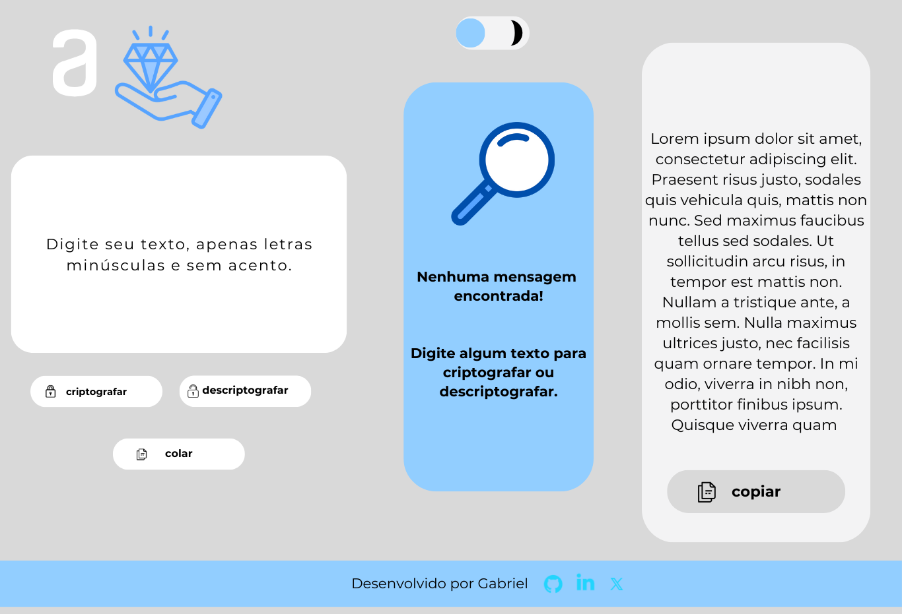

# Sobre

Challenge 01 Oracle Next Education + Alura, T6.  
Este projeto para iniciantes foi desenvolvido para o programa One Oracle + Alura e consiste em criar uma aplicação simples sobre criptografia de textos.

# Regras

- A letra "a" é convertida para "ai"
- A letra "e" é convertida para "enter"
- A letra "i" é convertida para "imes"
- A letra "o" é convertida para "ober"
- A letra "u" é convertida para "ufat"

**Requisitos adicionais:**
- Deve funcionar apenas com letras minúsculas.
- Não devem ser utilizados letras com acentos nem caracteres especiais.
- Deve ser possível converter uma palavra para a versão criptografada e também retornar a palavra original.

# Desenvolvimento

Este projeto utiliza HTML, CSS e Javascript. Foi desenvolvido utilizando media queries, focando em dispositivos móveis (mobile first) e em responsividade. Foi utilizado o aplicativo Canva para planejar o layout.

### Layout inicial

# Planejamentos

- [✅️] Design responsivo
- [  ] Modo noturno 
- [  ] Disponibilizar a opção de mudança de chave ao usuário.
- [  ] Atualização do layout e correção de bugs.
- [  ] Adicionar mais tratamentos de erros.

# Observações

Este projeto marca um primeiro contato com HTML, JavaScript, CSS e Git.
